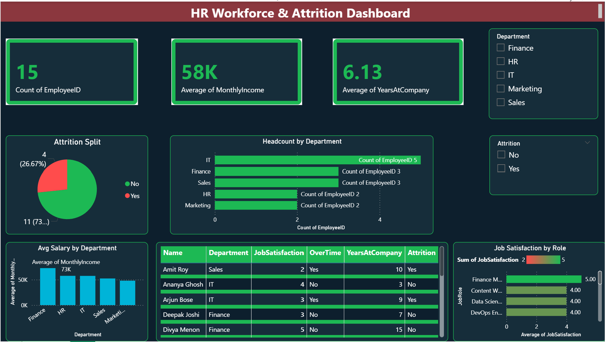

# 👥 HR Workforce & Attrition Analytics — Power BI


## 📌 Project Overview

A comprehensive **HR Analytics & Attrition Dashboard** built in Microsoft Power BI to help HR leadership and management track workforce trends, identify attrition risk, and support data-driven headcount planning.

> ✅ Reduced HR review preparation time by **45%**
> ✅ Covered **5 departments** with **15+ HR metrics**
> ✅ Attrition risk indicators using **conditional DAX logic**

---

## 🖼️ Dashboard Preview

> 📁 Screenshots are in the `/screenshots` folder.

| Workforce Overview | Attrition Heatmap |
|---|---|
|  | *(Add your screenshot here)* |

---

## 🎯 Key KPIs & Features

| KPI | Description |
|-----|-------------|
| 👥 Total Headcount | Active employees by department |
| 📉 Attrition Rate % | Monthly and YTD turnover rate |
| ⚠️ At-Risk Employees | Employees flagged for attrition risk |
| 💼 Department Turnover | Heatmap of turnover by department |
| 📊 Job Satisfaction Index | Average satisfaction score by role |
| 🕐 Avg Tenure | Average years at company per department |
| 💰 Salary Band Analysis | Compensation distribution by role/grade |

### ✨ Dashboard Features
- **Attrition Risk Flags** — Conditional DAX logic highlighting high-risk employees
- **Department Heatmaps** — Visual turnover intensity by team
- **Dynamic slicers** — Filter by department, gender, education, job role
- **Executive Summary Page** — One-page C-suite view of workforce health
- **Drill-through** — Click a department to see individual-level data

---

## 🛠️ Tools & Technologies

| Tool | Usage |
|------|-------|
| **Power BI Desktop** | Dashboard development & visualization |
| **Power Query (M)** | ETL from Excel & SharePoint data sources |
| **DAX** | Attrition measures, risk scoring, calculated columns |
| **Excel / SharePoint** | Source HR data |
| **Power BI Service** | Report publishing and sharing |

---

## 📐 DAX Measures Used

```dax
-- Attrition Rate
Attrition Rate % =
DIVIDE(
    COUNTROWS(FILTER('HR_Data', 'HR_Data'[Attrition] = "Yes")),
    COUNTROWS('HR_Data'),
    0
)

-- At-Risk Employee Flag
AtRisk Flag =
IF(
    'HR_Data'[JobSatisfaction] <= 2
        && 'HR_Data'[OverTime] = "Yes"
        && 'HR_Data'[YearsAtCompany] <= 3,
    "High Risk",
    IF('HR_Data'[JobSatisfaction] <= 3, "Medium Risk", "Low Risk")
)

-- Average Tenure by Department
Avg Tenure =
AVERAGEX(
    VALUES('HR_Data'[Department]),
    CALCULATE(AVERAGE('HR_Data'[YearsAtCompany]))
)
```

---

## 📁 Folder Structure

```
hr-workforce-attrition-powerbi/
│
├── 📊 reports/
│   └── hr_attrition_dashboard.pbix     # Main Power BI report file
│
├── 📂 data/
│   └── sample_hr_data.csv              # Sample dataset (anonymized)
│
├── 🖼️ screenshots/
│   └── dashboard_overview.png          # Dashboard preview image
│
└── 📄 README.md
```

---

## 🚀 How to Use

1. **Clone this repository**
   ```bash
   git clone https://github.com/your-username/hr-workforce-attrition-powerbi.git
   ```

2. **Open the `.pbix` file**
   - Install [Power BI Desktop](https://powerbi.microsoft.com/desktop/) (free)
   - Open `reports/hr_attrition_dashboard.pbix`

3. **Connect your data**
   - Go to `Home → Transform Data`
   - Update the data source path to `data/sample_hr_data.csv`
   - Click `Close & Apply`

4. **Explore the dashboard**
   - Use slicers to filter by Department, Gender, or Education Level
   - Check the **At-Risk** page for attrition flag analysis

---

## 📊 Data Schema

| Column | Type | Description |
|--------|------|-------------|
| EmployeeID | Text | Unique employee identifier |
| Department | Text | Employee's department |
| JobRole | Text | Specific job title |
| Gender | Text | Employee gender |
| Age | Integer | Employee age |
| YearsAtCompany | Integer | Tenure in years |
| MonthlyIncome | Decimal | Monthly salary (INR) |
| JobSatisfaction | Integer | Score 1–5 (1=Low, 5=High) |
| WorkLifeBalance | Integer | Score 1–4 |
| OverTime | Boolean | Yes/No |
| Attrition | Boolean | Yes = Left company |
| PerformanceRating | Integer | Score 1–5 |
| TrainingLastYear | Integer | Number of trainings attended |

---

## 💡 Key Insights from Sample Data

- Employees with **low job satisfaction + overtime** show **3x higher attrition**
- **Sales department** has the highest turnover rate at ~30%
- Employees with **< 3 years tenure** account for **65% of attrition cases**
- **Training investment** correlates positively with lower attrition

---

## 🔗 Connect with Me

[](https://linkedin.com/in/your-profile)
[](https://github.com/your-username)

---

> ⭐ If you found this project helpful, please give it a star!
